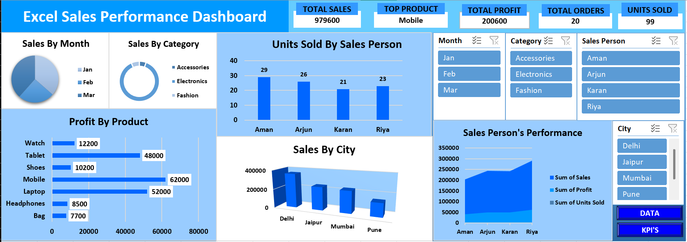

# Excel Sales Dashboard

## Project Overview

This project is an interactive Sales Dashboard built in Microsoft Excel.

## Skills Used

- Data Cleaning
- Excel Formulas
- Pivot Tables
- Pivot Charts
- KPI Cards
- Slicers

## Tools Used

- Microsoft Excel
- Pivot Tables
- Pivot Charts
- Slicers
- Excel Formulas

## Dashboard Features

- Sales by Month
- Sales by Category
- Sales by City
- Sales Person Performance
- Dynamic Filtering

## Dashboard Preview

## Key Insights

- Delhi generated the highest sales.
- Mobile was the top product.
- Riya achieved the highest sales performance.